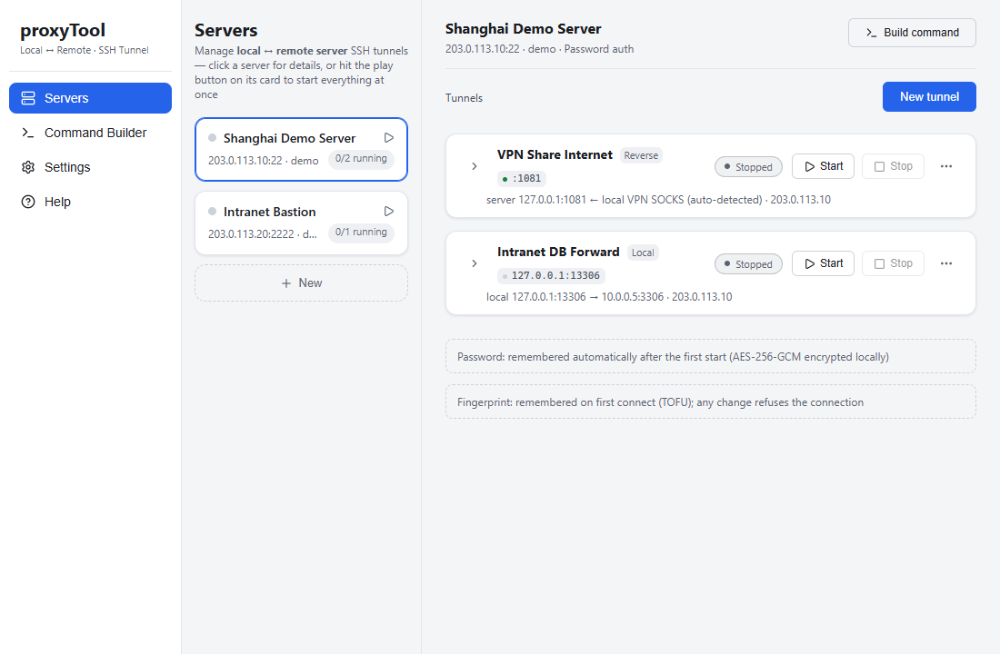

# proxyTool

[中文](README.md) | **English**



One-click SSH tunnels between your local machine and remote servers — with a visual manager on top.

Everything runs locally; all you need is the remote server's credentials (password or key). Passwords are stored **encrypted** (AES-256-GCM) on your machine, so restarts and autostart never prompt again.

## What it solves

| Goal | Tunnel type | Equivalent |
|---|---|---|
| Let a **server** reach the internet through **your machine's** proxy/VPN | Reverse | `ssh -R` |
| Access services **on the server / in its intranet** from your machine (remote DB, internal web) | Local | `ssh -L` |
| Use the server as a **SOCKS5 proxy** for your machine, reaching any host in its network | Dynamic | `ssh -D` |

The reverse tunnel auto-detects your local proxy port (with a built-in SOCKS fallback) — vendor-agnostic, works with any VPN client.

## Features

**Engine** (`core/`, pure Rust crate, zero GUI dependencies)
- Tunnels are first-class entities: multiple concurrent, persisted, autostart, tray-resident
- Auto-reconnect: fast retries → capped exponential backoff; counter resets after a stable connection; manual retry-now
- `-R 0` dynamic port allocation, actual port backfilled and persisted
- **Shared connections per server**: N tunnels over one SSH connection (one authentication), with MaxSessions budget admission and automatic fallback to dedicated connections
- **Injected-sshd compatibility**: some cloud security agents corrupt standard forwarding by injecting audit bytes — detected automatically, switching to a session-channel + server-side helper mode with no manual intervention
- Host-key TOFU verification (trust on first use, reject on change); password and key auth

**Security**
- SSH passwords / key passphrases are only persisted as AES-256-GCM ciphertext (`secrets.enc` + local key file); never in plaintext logs or configs
- Honest threat model: key lives on the same machine — this protects against casual snooping/grep, not a compromised host
- Host key change = fatal, no retry; UI offers trust / clear paths

**UI** (Tauri v2, three-pane Termius-style layout)
- Servers front and center: server blocks in the middle pane, polymorphic detail panel on the right; ▶ on a block starts/stops all its enabled tunnels
- Tunnel rows with five-state badges / ports / uptime / lazy ⋯ menu (retry, verify internet, deploy proxy, save as scenario…)
- Light & dark themes, three font sizes, **Chinese/English bilingual** (switchable in settings)
- Command builder: generates `ssh` / `autossh` commands for server↔server scenarios with per-flag explanations; named recipes
- Help page: three tunnel types illustrated, real-world scenario matching, FAQ
- All feedback via in-app toasts/dialogs — zero native popups

## Quick start

1. **Add a server**: Servers page → New; fill host / port / username (password is asked on first start, optionally remembered)
2. **Create a tunnel**: pick a server → New tunnel → choose a scenario preset (e.g. "VPN share", "reach intranet service") or blank custom
3. **Start**: hit ▶ on the server block to launch all enabled tunnels; closing the window minimizes to tray

## Download

Grab the Windows installers (NSIS `.exe` / MSI) from [Releases](https://github.com/xiaofuce/proxyTool/releases); on macOS, build from source.

## Build from source

Prerequisites: [Rust](https://rustup.rs/), Node.js ≥ 18, [Tauri v2 dependencies](https://v2.tauri.app/start/prerequisites/)

```bash
npm install
npm run tauri dev     # development
npm run tauri build   # installers (Windows: msi/nsis; macOS: app/dmg)
```

## Tests

```bash
cargo test -p proxy-tool-core                                          # all
cargo test -p proxy-tool-core --test e2e_tunnel -- --test-threads=1    # e2e (serial!)
```

E2E tests need a real SSH server: copy `core/.test-creds.local.example` to `core/.test-creds.local` (gitignored) and fill in host/password, or set `PROXYTOOL_TEST_SERVER / USER / PASS / PORT` env vars. **Real credentials never enter the repo.**

## Project layout

```
core/        tunnel engine (pure Rust): engine/ registry+state machine, transport/ std & compat modes,
             direct/ -L and -D, pool/ shared connections, secrets/ credential encryption, known_hosts/ TOFU
src-tauri/   Tauri GUI bridge: commands + event bridge + tray/autostart
src/         frontend (TypeScript, no framework): main/ui/theme/icons/i18n
assets/      documentation artwork
```
