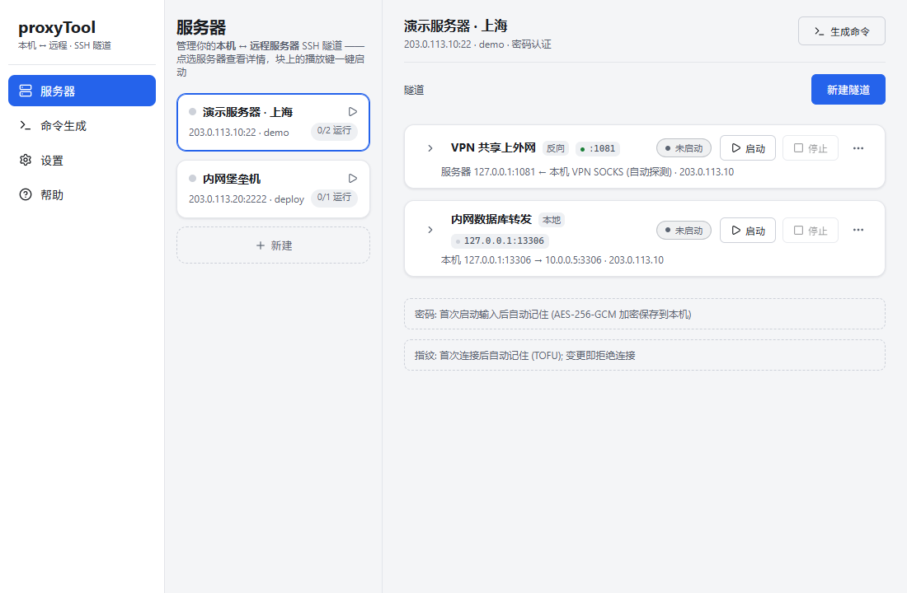

# proxyTool

**中文** | [English](README.en.md)



一键建立「本地电脑 ⇄ 远程服务器」的 SSH 隧道，并可视化地管理它们。

所有操作在本地完成，只需要远程服务器的账号密码（或私钥）。密码以 AES-256-GCM **密文**保存在本机，重启 / 开机自启免重输。

## 它解决什么问题

| 你想做的事 | 隧道形态 | 等价命令 |
|---|---|---|
| 让**服务器**借用**本机**的网络出口上外网（本机挂了代理/VPN，服务器出不了网） | 反向隧道 | `ssh -R` |
| 在**本机**访问**服务器上/服务器内网**的服务（远程数据库、内网 Web） | 本地转发 | `ssh -L` |
| 把服务器当作**本机的 SOCKS5 代理**，访问它内网的任意主机 | 动态隧道 | `ssh -D` |

反向隧道内置本机代理端口自动探测（也支持内置 SOCKS 兜底），不绑定任何特定 VPN 客户端。

## 功能特性

**隧道引擎**（`core/`，纯 Rust crate，零 GUI 依赖）
- 隧道是一等实体：多条并存、持久化、开机自启，托盘常驻后台
- 自动重连：快速重试 → 指数退避封顶；存活后计数归零；可手动立即重试
- `-R 0` 动态端口分配，实际端口自动回填保存
- **同档案共享连接**：同一服务器的多条隧道复用一条 SSH 连接（N 条隧道 1 次认证），带 MaxSessions 预算准入与超限自动回退独立连接
- **注入型 sshd 兼容**：部分云主机安全组件会向转发通道注入审计数据导致标准转发损坏——自动检测并切换为会话通道 + 服务器侧转发助手的兼容模式，无需人工干预
- 主机密钥 TOFU 校验（首连记住、变更即拒绝），密码 / 私钥双认证

**安全**
- SSH 密码 / 私钥口令仅以 AES-256-GCM 密文落盘（`secrets.enc` + 本机密钥文件），明文不落任何日志与配置
- 诚实的威胁模型：密钥与密文同机存放，防的是「顺手翻文件 / grep」，不防御本机已被入侵的对手
- 主机指纹变更 = 致命错误不重连，UI 提供信任 / 清除路径

**界面**（Tauri v2，三栏 Termius 式布局）
- 服务器为主角：中列服务器块 + 右列多态详情面板；块上 ▶ 一键启停该服务器全部隧道
- 隧道行五态徽章 / 端口 / uptime / 惰性 ⋯ 菜单（重试、验证外网、部署 proxy、存为场景…）
- 明暗双主题、字号三档、**中英双语**（设置内切换）
- 命令生成页：服务器↔服务器场景一键生成 `ssh` / `autossh` 命令并解释每个参数；「我的命令」命名保存
- 帮助页：三形态图解 + 真实场景对照 + FAQ
- 全部反馈走应用内 toast / dialog，零原生弹窗

## 快速上手

1. **添加服务器**：服务器页 → 新建，填地址 / 端口 / 用户名（密码首次启动时输入，可选记住）
2. **建隧道**：选服务器 → 新建隧道 → 选场景预设（如「VPN 共享」「访问内网服务」）或空白自定义
3. **启动**：点服务器块的 ▶ 一键启动全部启用中的隧道；关窗 = 收进托盘常驻

## 下载

从 [Releases](https://github.com/xiaofuce/proxyTool/releases) 获取 Windows 安装包（NSIS `.exe` / MSI）；macOS 请从源码构建。

## 从源码构建

环境要求：[Rust](https://rustup.rs/)、Node.js ≥ 18、[Tauri v2 依赖](https://v2.tauri.app/start/prerequisites/)

```bash
npm install
npm run tauri dev     # 开发模式
npm run tauri build   # 产出安装包 (Windows: msi/nsis; macOS: app/dmg)
```

## 测试

```bash
cargo test -p proxy-tool-core                        # 全部
cargo test -p proxy-tool-core --test e2e_tunnel -- --test-threads=1   # 端到端 (须串行)
```

端到端用例需要一台真实 SSH 服务器：复制 `core/.test-creds.local.example` 为 `core/.test-creds.local`（已被 gitignore 忽略）填入地址与密码，或设置环境变量 `PROXYTOOL_TEST_SERVER / USER / PASS / PORT`。**真实凭据永不入库。**

## 项目结构

```
core/        隧道引擎 (纯 Rust): engine/ 注册表+状态机, transport/ 标准与兼容两种传输,
             direct/ -L 与 -D, pool/ 共享连接, secrets/ 凭据加密, known_hosts/ TOFU
src-tauri/   Tauri GUI 桥接: 命令面 + 事件桥 + 托盘/自启
src/         前端 (TypeScript, 无框架): main/ui/theme/icons/i18n
assets/      文档插图
```
